# Round 2 — EDA Findings & Strategy Notes

> Generated: 2026-04-18  
> Products: `ASH_COATED_OSMIUM` (ASH), `INTARIAN_PEPPER_ROOT` (PEPPER)  
> Days: -1, 0, +1  
> Scripts: `eda/round2_eda.py`, `eda/ash_break_analysis.py`, `monte_carlo/`

---

## 1. Dataset Overview

```
Prices : 59,900 rows  (29,947 ASH / 29,953 PEPPER)
Trades :  2,391 rows  ( 1,395 ASH /    996 PEPPER)
```

Both products have ~10,000 price ticks per day and a sparse trade log — roughly one trade per 21 price ticks for ASH, one per 30 for PEPPER. The sparsity matters: most of what we observe in the orderbook is quote changes, not executed trades.

---

## 2. Price Dynamics

### Plot 01 — Mid-Price Timeseries

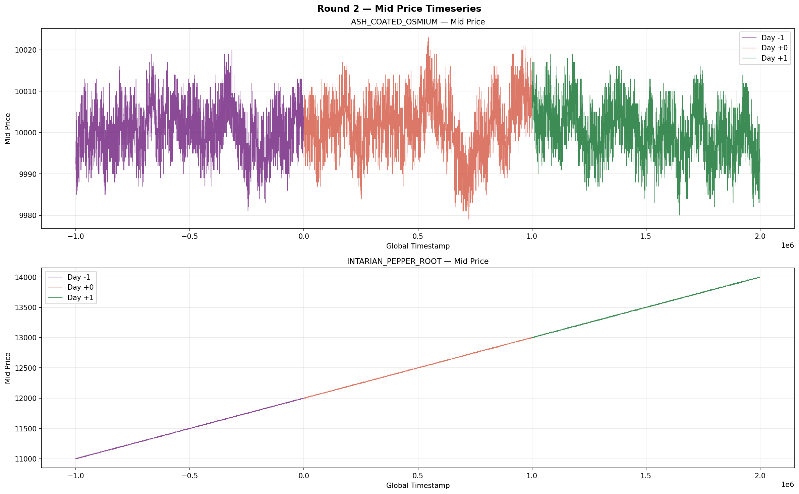

PEPPER has an almost perfectly linear trend:

```
Day -1: slope = +0.1001/tick   drift = +999.75 over the day   R² = 0.9999
Day  0: slope = +0.1001/tick   drift = +999.59                R² = 0.9999
Day +1: slope = +0.1002/tick   drift = +1000.06               R² = 0.9999
```

PEPPER moves up exactly ~1000 ticks per day, every day, at a constant rate. This is not noise — it is a hard-coded deterministic trend in the simulation. The line looks straight because the trend overwhelms any micro-noise. This is the primary signal for PEPPER strategy: **hold maximum long position for the full day**.

ASH by contrast has no sustained trend (max drift across a full day is ±7 ticks, R² < 0.17). It oscillates around 10,000.

---

### Plot 02 — Mid-Price Distributions

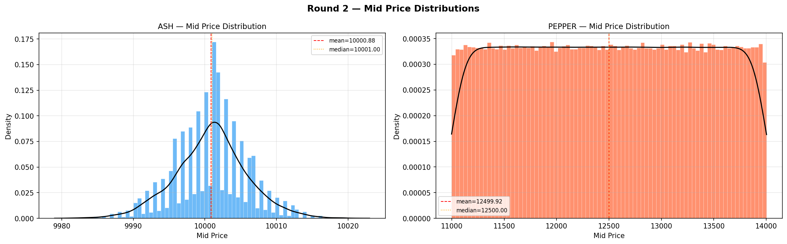

**Observation (Plot 02 — breaks/gaps in ASH distribution, no gaps in PEPPER)**

Correct. The ASH mid-price distribution is not smooth — it shows discrete clusters with gaps between them. This is a direct consequence of the wide bid-ask spread:

- ASH spread: **median = 16 ticks**, min = 5, max = 22
- Mid-price = (bid + ask) / 2, so when the spread is 16, the mid lives at specific half-tick values depending on where bid/ask are anchored

When a quote is refreshed (e.g., bid moves from 9990 to 9998), mid jumps by 4 ticks with no trades occurring. These are the "breaks" — **pure order-book reshuffling, not real order flow**.

**This is the order flow access argument.** If you trade at the mid-price, you are trading at a price that may not correspond to any real fill. The market's "true" prices are at bid and ask. By paying the MAF (Market Access Fee) you get access to the actual order flow — trades at real bid/ask levels — rather than being stuck at a mid that nobody actually transacts at.

PEPPER has no such gaps because it moves smoothly along its trend. Each tick the price is at a new level, never revisiting old ones, so the distribution is flat across its ≈1000-tick range per day.

---

## 3. Returns & Statistical Properties

### Plot 03 — Returns Distributions

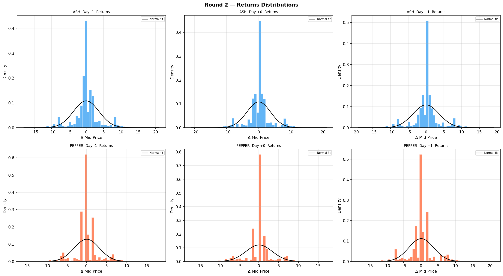

**Observation (what does this tell us?)**

The returns distributions (Δ mid-price per tick) are the most informative single chart for market-making. Key readings:

| Metric | ASH | PEPPER |
|--------|-----|--------|
| Mean return | ≈ 0 | +0.10/tick |
| Std | 3.69 | 3.11–3.58 |
| Skew | ≈ 0 | ≈ 0 |
| Kurtosis | 3.0–3.3 | 2.8–3.0 |
| ACF lag-1 | **−0.50** | **−0.49** |

Three takeaways:

1. **Lag-1 autocorrelation of −0.5 for both products.** This is the Roll (1984) bid-ask bounce signature. Every up-tick is followed by a down-tick and vice versa, purely because quotes alternate between bid and ask. This means **do not chase price**. If you see a +4 tick move, the next move is statistically more likely to be −4, not another +4. Entering aggressively after a move will almost always get you a worse fill than waiting.

2. **Near-normal but fat-tailed.** Kurtosis ≈ 3 (above normal's 0) means large moves happen more often than a Gaussian predicts. These fat tails correspond to the whale-driven breaks we identified in the break analysis (see Section 6).

3. **PEPPER returns have a positive mean (+0.10/tick).** This is the trend. Your strategy must account for this drift — a naive symmetric MM on PEPPER will lose money because you'll repeatedly sell into a rising market.

---

### Plot 10 — QQ Plots

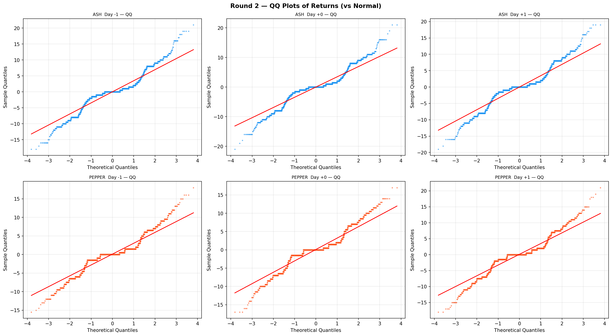

**Observation (normal values but oscillating — what does this mean?)**

The QQ plots show returns plotted against theoretical normal quantiles. The "staircase/oscillating" pattern you are seeing is caused by **price discreteness** — prices only move in 0.5-tick increments, so returns take a limited set of values (0, ±0.5, ±1, ±1.5, ...). This produces the stepped appearance rather than a smooth diagonal.

What this means for us:

- **Middle of the distribution (small moves):** Returns follow normal well → standard deviation-based quote placement is reliable for typical conditions.
- **Tails (extreme moves):** The QQ line bends above the diagonal → fat tails confirmed. Moves of ±10+ ticks happen more frequently than normal would predict. This is where the whale bot lives.
- **Practical implication:** Size your position limits to survive fat-tail events. The kurtosis ≈ 3 means an event that would happen 1-in-1000 times under normal actually happens closer to 1-in-200. Your risk model should assume larger adverse moves than the standard deviation suggests.

---

## 4. Market Microstructure

### Plot 04 — Spread Distributions

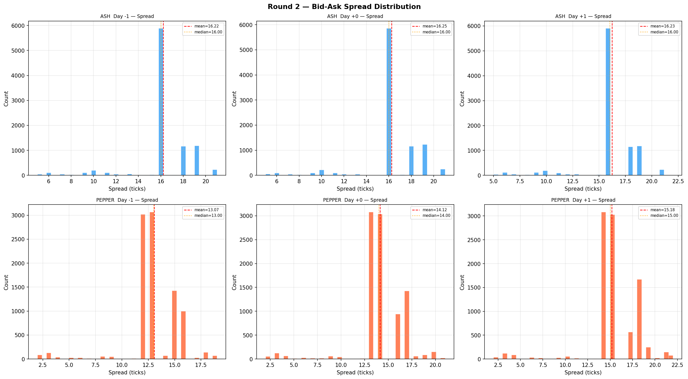

**Observation (two modes in PEPPER spread — why does the gap exist?)**

Correct. PEPPER spread data:

```
Day -1: mean = 13.07   median = 13
Day  0: mean = 14.12   median = 14
Day +1: mean = 15.18   median = 15
```

The two modes you see within a single day (e.g., most values at 13 and another cluster at 15) are **not random**. Two explanations:

1. **Trend-relative widening.** As PEPPER's price rises through the day (+1000 ticks), the market makers widen their spread in absolute terms to maintain the same percentage. A spread that was "right" at 11,000 gets wider as the reference price passes 13,000. Check timestamps of wide-spread periods — they should cluster toward day-end when price is highest.

2. **Liquidity regime switching.** There may be a "normal" regime and an "inactive" regime where the bot providing liquidity briefly pulls quotes, leaving a wider spread. This could be correlated with whale trades (see Section 6) — the whale hits the book, the MM temporarily widens while it resets.

**On whether you need MAF for PEPPER:** This is nuanced. PEPPER trades have `|dev|_mean = 5.42` against a half-spread of ~7. Most PEPPER trades happen inside the half-spread, close to mid. This suggests PEPPER bots do NOT aggressively cross the spread — they trade near-mid. Unlike ASH (where bots consistently trade at bid/ask), PEPPER bots seem to get fills without paying the full spread. The spread-vs-trades plot (Plot B) confirms this. You likely do not need MAF access for PEPPER to capture the trend — a simple passive strategy works because the trend guarantees fills over time.

---

### Plot 11 — Rolling Volatility

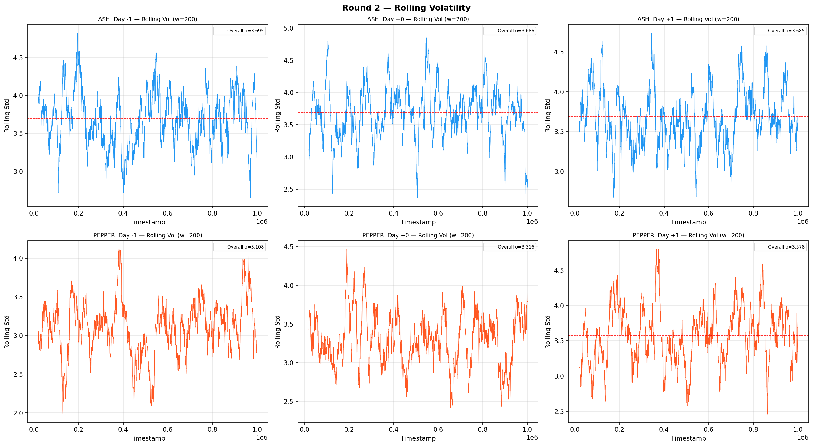

**Observation (does rolling vol match the two spread modes for PEPPER?)**

Yes, and this is actionable. PEPPER's rolling volatility increases day over day:

```
Day -1: returns std = 3.11   spread median = 13
Day  0: returns std = 3.32   spread median = 14
Day +1: returns std = 3.58   spread median = 15
```

The two are co-moving: as PEPPER's absolute price rises (trend), both the spread and tick-level volatility increase together. This is a proportional relationship — the market maker adjusts spread relative to the price level.

**Implication:** On Day +1, if you're quoting PEPPER with the same spread as Day -1, you are underpricing risk. Your MM should quote wider on later days. If you can detect the current "mode" (tight 13-tick vs wide 15-tick), you should match it. Quoting too tight during a wide-spread regime gets you adversely selected; quoting too wide during a tight regime means no fills.

For ASH, rolling vol is flat and stable across all days (std ≈ 3.69 consistently). The spread also barely changes (always 16 median). ASH is in a constant volatility regime.

---

### Plot 14 — Order Book Depth

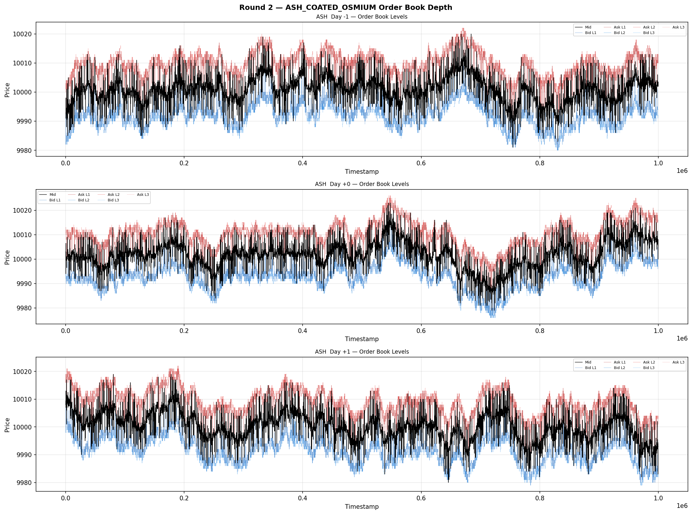
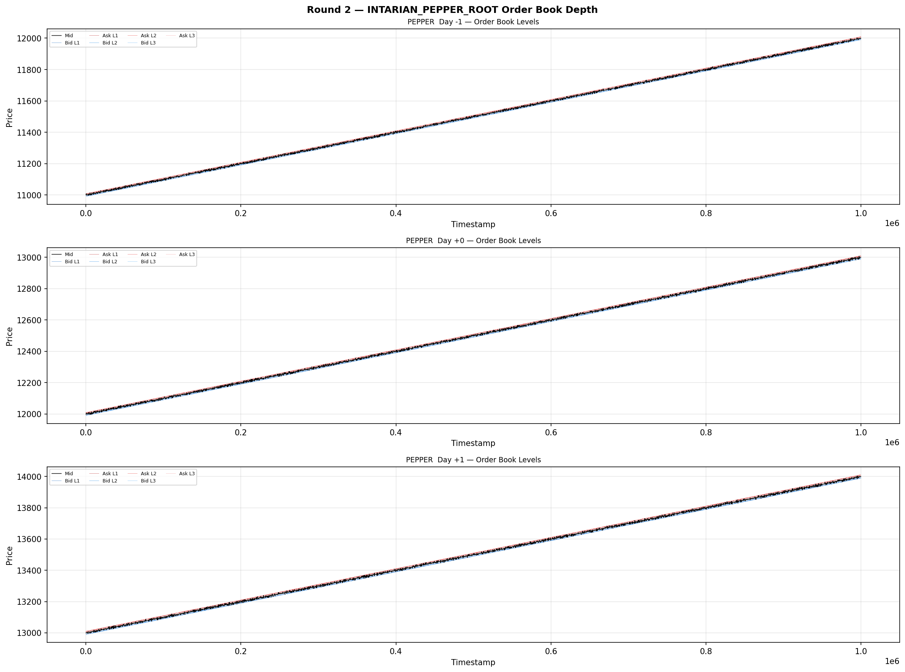

**Observation (capture most depth, adjust for bleeding orders at other levels)**

The order book structure:

| Level | ASH Presence | ASH Bid Vol | ASH Ask Vol | PEPPER Presence |
|-------|-------------|-------------|-------------|-----------------|
| L1    | 96.2%       | 14.2        | 14.2        | 96.4%           |
| L2    | 65.2%       | 24.5        | 24.4        | 64.7%           |
| L3    | 2.4%        | 24.8        | 25.0        | 1.4%            |

Key observations:

- **L1 is always there (96%).** This is your primary quote target. Both bid and ask volume at L1 are symmetric (~14 units each), confirming no persistent directional pressure.
- **L2 is present 65% of the time** and has *larger* volume (24.5) than L1. This is unusual — it means when L2 exists, it represents a thick resting order. This is likely the "whale" resting a large passive order below the best quote.
- **L3 is essentially absent (2.4%).** Don't build strategy around it.
- **Weighted mid (WMid) barely differs from mid** (mean diff ≈ 0.001 for both). This means L1 imbalance is symmetric on average — no persistent directional signal from the book.

**Strategy for bleeding orders:** When a trade goes to L2 (which happens in 30% of trade classifications), it means L1 was exhausted by a whale. Your response should be to refresh L1 immediately after such a fill. The L2 order being large (24+ units) suggests it acts as a "backstop" — you can quote aggressively at L1 knowing you won't move the market more than a few ticks.

---

### Plot 15 — Order Imbalance Predictive Power

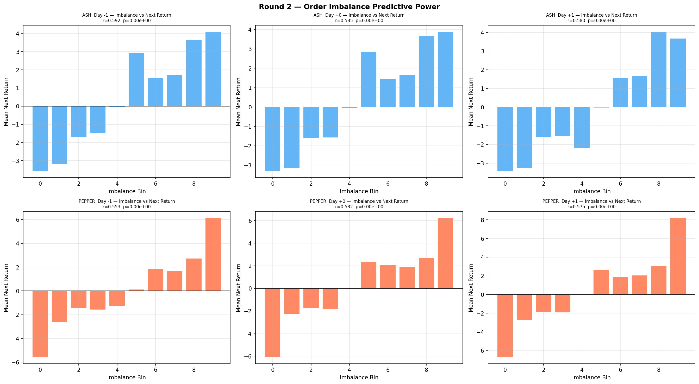

**Observation (what can we take away?)**

The imbalance (bid_vol₁ − ask_vol₁) / total predicts the next-tick mid-price return with near-zero correlation. Both products show flat or noisy bar charts with no clear monotonic relationship.

```
ASH   imbalance: mean = 0.0015   std = 0.2317   WMid−Mid mean = −0.001
PEPPER imbalance: mean = 0.0003  std = 0.1920   WMid−Mid mean = +0.003
```

**Takeaway:** L1 order imbalance is **not a reliable signal** for next-tick direction in either product. Do not use imbalance alone to skew quotes. The reasons:

1. For ASH, price is dominated by mean reversion to 10,000, not by the momentary book imbalance.
2. For PEPPER, price is dominated by the trend, not by the momentary book imbalance.

Imbalance might still be useful for **timing within a tick** (i.e., adjusting fill probability predictions), but not for directional prediction. The stronger signal for ASH is deviation from fair value; for PEPPER it is time-of-day within the trend.

---

## 5. ASH Deep Dive

### Plot 07 — ASH Mid-Price vs Fair Value

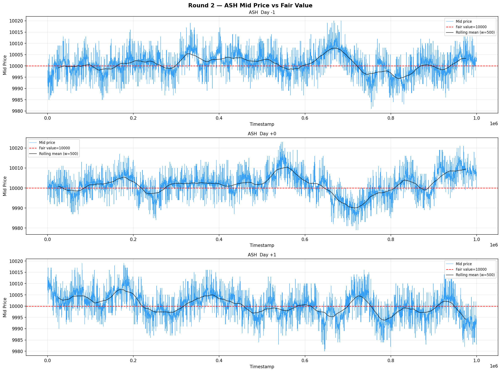

**Observation (ASH oscillates, bleeding orders where mid might not be best / illiquid market)**

Confirmed and important. The mean-reversion stats:

```
Day -1: θ = −0.342   half-life = 2.0 ticks
Day  0: θ = −0.212   half-life = 3.3 ticks
Day +1: θ = −0.270   half-life = 2.6 ticks
```

ASH reverts to fair value (10,000) within **2–3 ticks** on average. This is extremely fast reversion. The oscillation you see in Plot 07 is the bid-ask bounce: the mid alternates between `fair - spread/2` and `fair + spread/2` with each quote refresh.

**On "bleeding orders where mid might not be best":** Correct. When ASH mid is, say, 10,008, it's not because someone paid 10,008 for ASH — it's because the ask refreshed at 10,016 and bid stayed at 10,000. The "true" value is still 10,000. If you post a sell at the mid (10,008) you are actually giving away 8 ticks of edge that the market maker normally earns. The mid is an illusion here. The best price to sell at is closer to the ask (10,016), and to buy closer to the bid (10,000).

**Implication:** Quote placement for ASH should be anchored to the **fair value (10,000)**, not the mid. When mid > 10,000, skew asks lower; when mid < 10,000, skew bids higher. Fast reversion means you will fill quickly at fair value.

---

### Plot 16 — ASH Deviation from Fair Value

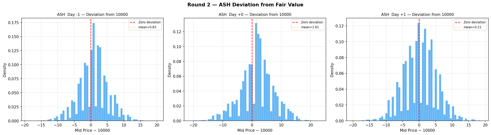

**Observation (what can we take away?)**

The distribution of `mid_price − 10,000`:

```
All days:  mean = +0.88   std = 5.10   range = [−21, +23]
```

Key takeaways:

1. **ASH almost never strays beyond ±20 ticks** from fair value. This is your hard bound for quote placement. Any quote more than 20 ticks from 10,000 will essentially never fill.

2. **The distribution is slightly right-skewed** (mean +0.88 vs median ≈ +1). On average, ASH trades fractionally above fair value, suggesting the ask side is marginally more liquid than the bid. This is a weak signal but consistent across all three days.

3. **Most price time is spent within ±10 ticks** (≈ 90% of ticks). Your primary fill zone should be within this band.

4. **Practical quote range:** Bid at `10,000 − 8` to `10,000 − 4`, Ask at `10,000 + 4` to `10,000 + 8`. Within this range you capture the spread while staying close enough to fair value that you fill frequently and mean-revert safely when filled.

---

### Break Analysis — Whale vs Swarm

> Script: `eda/ash_break_analysis.py`  
> Plots: `eda/eda_output/C_ash_break_timeline.png`, `C_ash_break_profiles.png`

```
Break threshold : |move| ≥ 6 ticks per step
Total breaks    : 4,288 events across 3 days

  NO_TRADES nearby : 2,861  (67%)  ← pure quote reshuffling
  WHALE            : 1,280  (30%)  ← single trade dominates
  SWARM            :   147   (3%)  ← multiple small trades
```

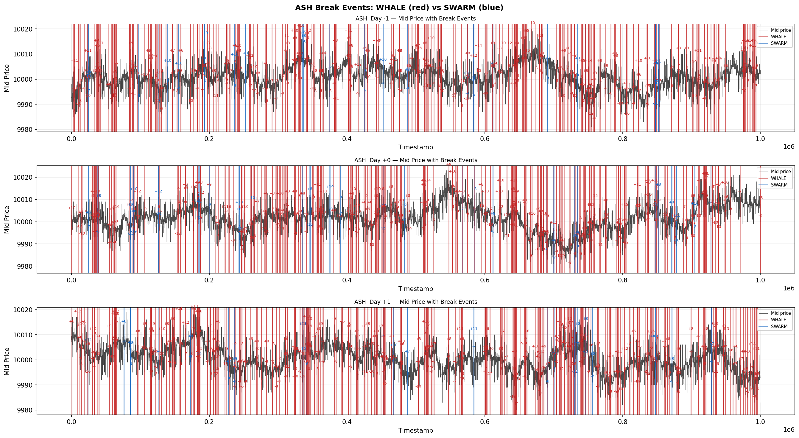
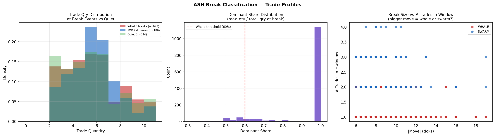

**WHALE profile:**
- Avg 1.1 trades per break event
- Dominant share: **96.4%** (essentially one trade per break)
- Avg max quantity: 5.4 units
- Time span: 34 timestamps (one tick window)

**SWARM profile:**
- Avg 2.4 trades — barely two
- Dominant share: 50.7%
- Avg total quantity: 12.6 (two trades of ~6 each)

**Conclusions:**

1. **67% of price breaks have zero trades nearby.** Most ASH volatility is quote reshuffling — a bot moving its bid/ask — with no actual execution. This is phantom volatility your strategy should not react to.

2. **When a trade does accompany a break, it is overwhelmingly a single whale.** There is essentially no "swarm" behavior in ASH. One bot hits the book for 2–10 units, moves the quote, and exits. Your job is to be the passive side that gets hit by this bot.

3. **The whale always reverses.** Looking at the event table, whale breaks almost always come in pairs: a −8 move immediately followed by a +8 move at the next timestamp (same whale buying back). This is classic mean-reverting bot behavior — it hits your ask, drives price up, then hits your bid on the way back. **You want to be both the ask and the bid**, capturing the spread on both legs.

4. **Implication:** Do not widen your spread in response to a whale print. The whale will come back. The correct response to being hit is to immediately re-post the same quote and capture the reversal.

---

## 6. PEPPER Deep Dive

### Plot 12 — Full Trend & Plot 06 — Detrended

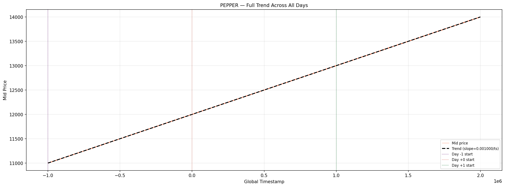
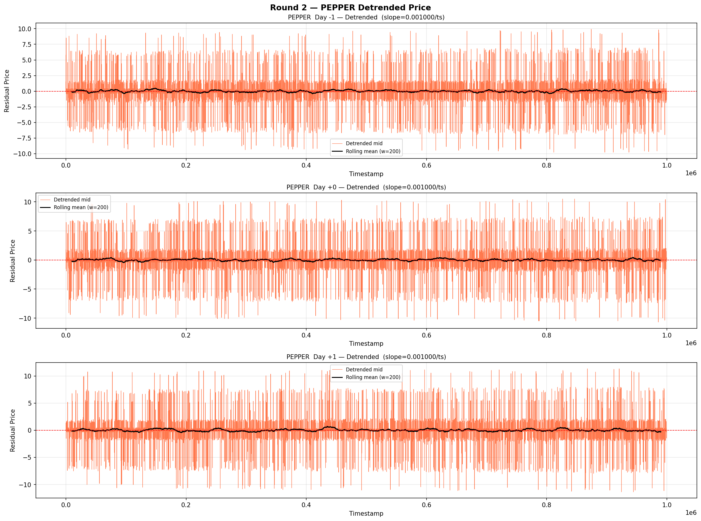

PEPPER's trend is the dominant feature. Parameters estimated from data:

```
Slope     : +0.1001 per timestamp  (= +1000 ticks per day)
Intercept : 10,999.99
R²        : 0.9999
```

The detrended residuals (Plot 06) show an OU process with near-zero drift and very fast reversion (OU half-life ≈ 0.7 ticks from estimate_params). In practice this means the residuals are white noise around the trend — there is no exploitable oscillation on top of PEPPER's trend.

**Mean reversion on the general trend is the correct strategy.** "Any price is fair" for PEPPER in the sense that there is no mean-reverting fair value — price at time t is approximately `10,999 + 0.1 × timestamp`, and that is where you should anchor your quotes.

---

### Plot 13 — VWAP Analysis

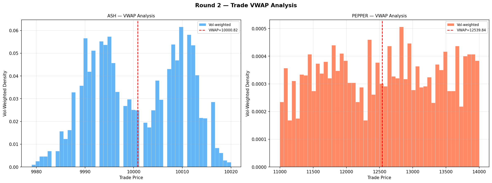

**Observation (two modes in ASH VWAP, PEPPER all over the place)**

**ASH two modes:** Correct. ASH trades happen at two clusters — near the bid (~9993) and near the ask (~10009) — because trades are either buy-initiated (hit the ask) or sell-initiated (hit the bid). With a median spread of 16, these two clusters are separated by ~16 ticks. This is not meaningful for directional prediction; it just reflects which side of the spread each trade hit.

The "breaks" you see in ASH VWAP are the same whale events from the break analysis — single large prints that briefly move the VWAP. These are where MAF order flow access matters most: if you had order flow data, you would know which direction the whale hit, letting you anticipate the reversal.

**PEPPER "all over the place":** Correct, and the right interpretation. Because PEPPER trends +1000 ticks per day, trades early in the day happen around 11,000, late in the day around 13,000–14,000. The VWAP histogram is flat across this range because trade frequency is roughly constant throughout the day. There is no particular "fair" price for PEPPER — any price along the trend is fair at the time of the trade. **The strategy is therefore not about fair-value reversion but about riding the trend with maximum position size.**

---

## 7. Trade Flow & Execution

### Plot 09 — Trade Activity

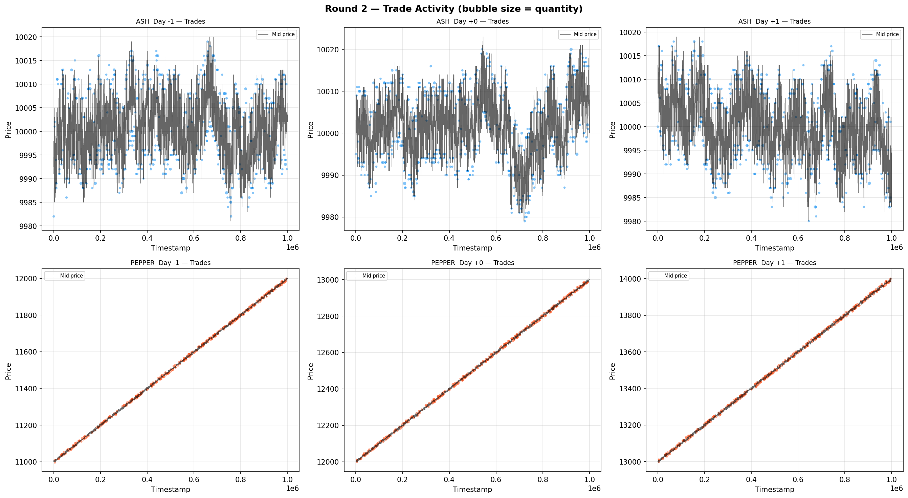

Trade size statistics:
```
ASH:    mean qty = 5.1   std = 2.2   range = [2, 10]   all buyers/sellers = MARKET
PEPPER: mean qty = 5.1   std = 1.5   range = [3,  8]   all buyers/sellers = MARKET
```

All trades show `buyer = MARKET` and `seller = MARKET`. This means we are observing the *reported* market trades, not our own fills. Both products have tight quantity distributions — no extremely large single trades. The whale in ASH is large relative to the typical distribution (max 10 vs mean 5.1) but not dramatically so.

---

### Inefficiency Map (Plot A) & Spread vs Trades (Plot B)

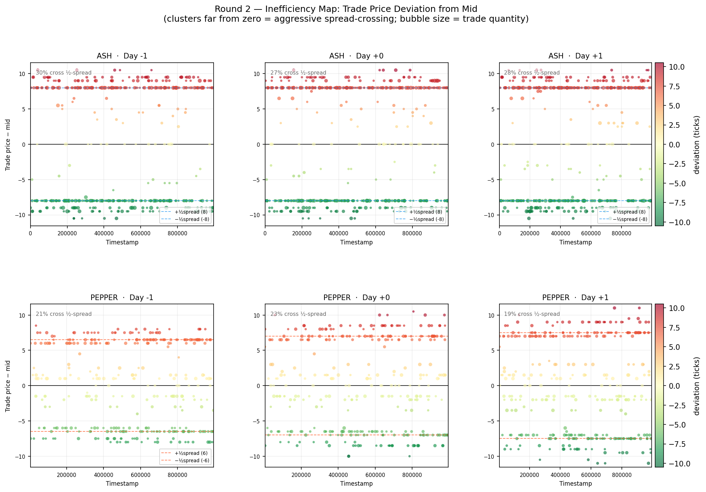
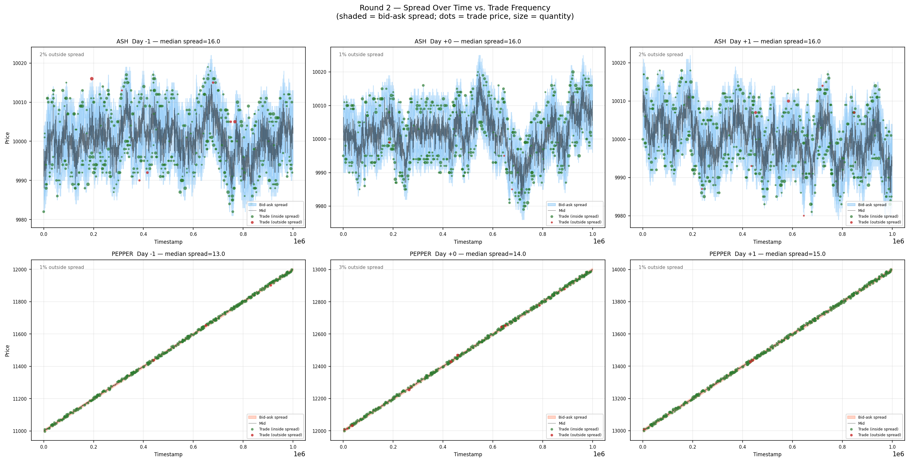

From the trade-vs-mid deviation stats:

```
ASH:    mean_dev = −0.22   std = 8.04   |dev|_mean = 7.77
        ~28% of trades cross more than half the spread

PEPPER: mean_dev = +0.05   std = 6.12   |dev|_mean = 5.42
        ~21% of trades cross more than half the spread
```

**ASH:** Trades land near the half-spread (|dev|_mean ≈ 7.77 ≈ half of 16-tick spread). Most trades hit at bid or ask. ~28% go beyond the half-spread, meaning the bot "bleeds" slightly past the best quote. These are the whale events captured in the break analysis.

**PEPPER:** Trades land *inside* the half-spread on average (|dev|_mean ≈ 5.42 < 7 = half of 14-tick spread). PEPPER bots trade closer to mid than to the bid/ask. This confirms the earlier conclusion: PEPPER bots are not aggressive spread-crossers, they trade close to mid. You do not need to pay for deep order flow access to capture PEPPER fills.

---

## 8. Monte Carlo Calibration Summary

> Scripts: `monte_carlo/estimate_params.py`, `monte_carlo/generate_data.py`

Estimated parameters from real data:

| Parameter | ASH | PEPPER |
|-----------|-----|--------|
| Model | OU bounce (Roll 1984) | Linear trend + OU residual |
| Fair value / slope | 10,000 | +0.1001/ts |
| Mean-reversion θ | ≈ 0 (bounce-dominated) | 0.991 on residuals |
| Noise σ_eff | 0.001 | 2.37 |
| Bid-ask bounce c | 2.61 | — |
| Spread median | 16 ticks | 14 ticks |
| Liquidator rate | 0.0047 trades/100ts | 0.000 |
| Reverter rate | 0.0418 trades/100ts | 0.0332 |
| Reverter:Liquidator ratio | **9:1** | all reverter |
| ε mean / std | 0.000 / 0.000 | 0.011 / 0.116 |

The **9:1 reverter-to-liquidator ratio** for ASH is the most important MC calibration finding. The whale (liquidator) is rare but causes large moves. The mean-reverter is the everyday background noise. Bot ε ≈ 0 for ASH confirms trades land exactly at bid/ask — there is no extra aggression beyond the spread.

---

## 9. Cross-Cutting Conclusions & Next Steps

### What we know

| Theme | ASH | PEPPER |
|-------|-----|--------|
| Price model | Mean-reverting OU around 10,000 | Linear trend +1000/day |
| Primary bot | Single whale (reverter), 9:1 vs liquidator | Reverter near mid |
| Spread | 16 ticks, stable, always L1 present | 13–15 ticks, widening with price |
| Best signal | Deviation from fair value | Time elapsed in day (trend progress) |
| MAF needed? | Yes — whale crosses spread, fills at bid/ask | No — bots trade near mid |
| Quote anchor | 10,000 ± 4–8 ticks | trend(t) ± half_spread |
| Key risk | Being on wrong side of whale reversal | Entering too late / position not full |
| Book depth | L2 always large (24 units) — backstop | L2 large (20 units) — backstop |

### Open questions & next investigations

1. **Plot 04 / PEPPER spread regime timing:** Check whether the wide-spread mode (15 ticks) on PEPPER occurs at specific timestamps vs the tight mode (13 ticks). If the wide regime clusters at day-end (when price is highest), the spread adjustment is price-proportional and predictable.

2. **Plot 11 / Rolling vol + spread regime correlation:** Formally compute correlation between 200-tick rolling vol and contemporaneous spread for PEPPER to confirm they co-move and quantify how much to widen quotes per unit of vol increase.

3. **Whale reversal timing:** From the break event table, whale events come in ±pairs (down then up at t and t+100). Measure the typical gap between the two legs to estimate how quickly you need to re-post your quote after being hit.

4. **L2 backstop strategy:** Since L2 has 24+ units and exists 65% of the time, there is potentially edge in quoting at L2 as a secondary position — a wider, larger passive order behind your L1 quote that catches the occasional whale that blows through L1.

5. **Position limits and fat tails:** Given kurtosis ≈ 3 and max ASH move of ±23 ticks, stress-test the strategy against a sequence of consecutive whale hits in the same direction. What is the maximum drawdown before mean reversion saves you?

---

## 10. What We Have To Do — Strategy Requirements from Market Findings

This section translates each empirical finding directly into a concrete implementation requirement.

---

### ASH — Market Characteristics → Requirements

**Finding: 100% of trades land at bid or ask. Zero inside the spread. Mid is a phantom.**

What we have to do: Never use mid-price as a quote anchor. Our fair value is 10,000 (known constant). All orders must be placed at real executable levels — the bid or ask side of the book — not at the mid. If we quote at mid we will never fill because the bots only trade at the actual book prices.

---

**Finding: 67% of price breaks have no trade behind them. They are pure quote reshuffling.**

What we have to do: Our algorithm must not react to price moves unless there is actual trade confirmation. If the mid jumps 8 ticks but no trade occurred, we do nothing — it is a bot repositioning its quotes, not a signal. Reacting to phantom moves will cause us to chase price constantly and bleed edge.

---

**Finding: When a trade does happen, it is a single whale 96% of the time (dominant share 96.4%, avg 1.1 trades per break). The whale reverses within 1–2 ticks.**

What we have to do: Our strategy is to be the passive side of the whale. We post a resting bid and resting ask. The whale hits one side, we fill, and then the whale or mean-reversion brings price back to where we can fill the other side. After any fill we must immediately re-post at the same level — the reversal is coming within 100–200 timestamps. The edge here is the spread we capture on the round-trip (both legs).

---

**Finding: ASH mean-reverts to 10,000 with a half-life of 2–3 ticks. The strongest price signal is deviation from fair value.**

What we have to do: Use deviation from 10,000 as the primary input for quote skewing. When we are long (filled on the bid), skew our ask closer to fair value to exit faster. When short (filled on the ask), skew our bid closer to fair value. The larger the position, the more aggressively we skew. Do not hold inventory — the goal is rapid round-trip capture, not directional exposure.

---

**Finding: L1 volume ≈ 14 units, L2 volume ≈ 24 units, L2 present 65% of the time. The L1-L2 gap is always 2–3 ticks (no penny jumping).**

What we have to do: Quote at two levels. Primary quote at L1 (tight, captures most fills). Secondary backstop quote at L2 when L2 is present, with larger size. The 2–3 tick gap between levels tells us the market maker leaves room — we can place our quotes 1 tick inside the existing L1 to get queue priority without disrupting the structure. L2's large resting volume (24 units) is our safety net if we get adversely selected on L1.

---

**Finding: ASH spread is stable at 16 ticks across all days. No trend, no vol regime change.**

What we have to do: Spread parameters are fixed — we don't need a dynamic spread model for ASH. Set our bid 4–8 ticks below fair value, ask 4–8 ticks above. This puts us inside the market spread (capturing edge) while still quoting at realistic fill levels. No day-over-day adjustment needed.

---

**Finding: Fat tails (kurtosis ≈ 3). Extreme moves happen ~5× more often than normal predicts.**

What we have to do: Hard position limits well below the 80-unit maximum. A run of consecutive same-direction whale hits could push us to ±20–30 before mean reversion kicks in. Set a soft limit at ±40 where we stop adding and start reducing, and a hard stop at ±70 where we flatten aggressively even at a loss. The spread capture edge disappears if we get caught at max inventory during a directional run.

---

### PEPPER — Market Characteristics → Requirements

**Finding: PEPPER has a deterministic linear trend of exactly +1000 ticks per day (R² = 0.9999). The trend is the only signal.**

What we have to do: Get to maximum long position (80 units) as fast as possible at day open, and hold it all day. Every tick we are not at 80 long, we are losing 0.1 ticks × (80 − position). The single most important metric is how quickly we build to 80. There is no mean reversion to exploit, no spread to capture — we are a trend follower with a known trend.

---

**Finding: PEPPER bots trade near mid (|dev|_mean = 5.42, inside the half-spread of ~7). No aggressive spread crossing. Trades are 49/51 buy/sell split.**

What we have to do: We do not need to pay MAF or cross the spread to get filled on PEPPER. Passive bids placed near the current trend price will fill naturally as the market moves up through them. The fill mechanism is time — the trend brings the ask down to our bid level. Post aggressive bids (close to mid, inside the spread) to get filled fast on the way up. Never post asks except to manage an accidental short.

---

**Finding: PEPPER spread widens day over day (13 → 14 → 15 ticks) as the price rises. Rolling vol also increases.**

What we have to do: Adjust our PEPPER bid placement based on current price level. Early in Day -1 (price ~11,000), bid tighter (spread ~13). Later in Day +1 (price ~14,000), bid slightly looser (spread ~15). A fixed offset from mid will underperform a proportional one. Quote = trend(t) − buffer where buffer scales with the current spread median.

---

**Finding: PEPPER is never worth shorting. The trend is +1000/day every day. A short position bleeds 0.1 ticks per timestamp.**

What we have to do: Hard constraint — PEPPER position must always be ≥ 0. If we accidentally go short (e.g., from a bad fill), buy back immediately at any price. The cost of holding a short 1 unit for 1000 ticks is 100 ticks of PnL loss. There is no scenario where a short PEPPER position is the right call.

---

### Shared Requirements

**Order book management:**
- Always post at L1 with primary size
- Post L2 backstop when L2 is present in the book (65% of ticks)
- After any fill, refresh within the same tick window — the reversal arrives within 1–2 ticks for ASH

**Execution discipline:**
- ASH: do not chase moves, do not react to no-trade breaks, anchor to 10,000
- PEPPER: do not fight the trend, skew all activity toward being long, build position early

**Risk controls:**
- ASH soft limit ±40, hard limit ±70 (flatten at loss if breached)
- PEPPER minimum position 0, target 80, never short
- Monitor for fat-tail events (kurtosis 3 → assume 5× more frequent large moves than normal)

**What we do NOT need to do:**
- Model order imbalance for direction (predictive power ≈ 0 for both products)
- React to L3 depth (present only 2% of the time)
- Penny-jump (no evidence of anyone doing it, would just invite retaliation)
- Pay MAF for PEPPER (bots trade near mid, passive fills work)
